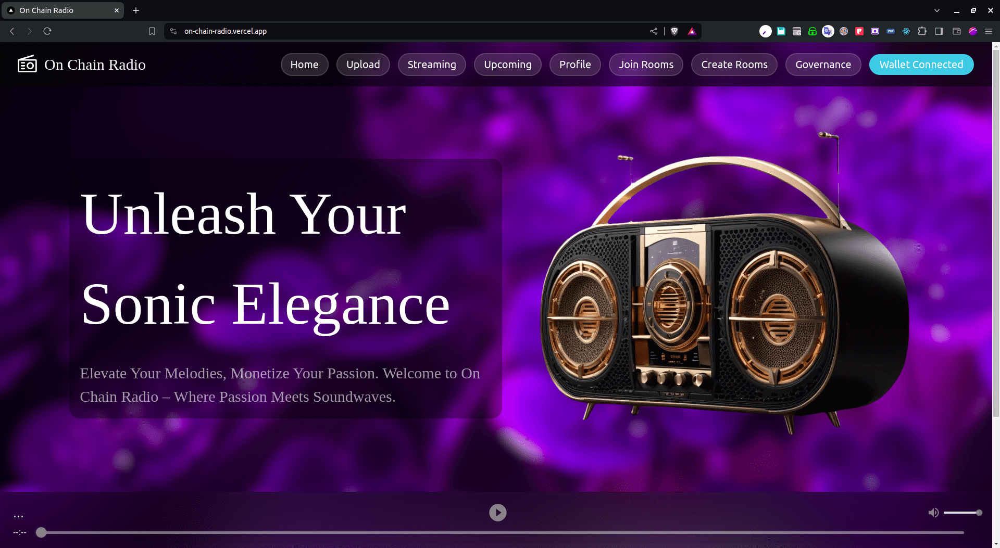
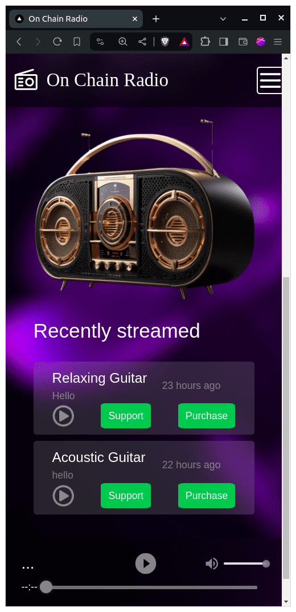
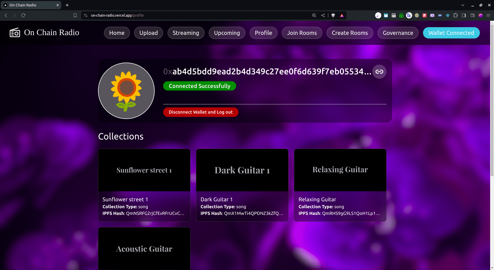
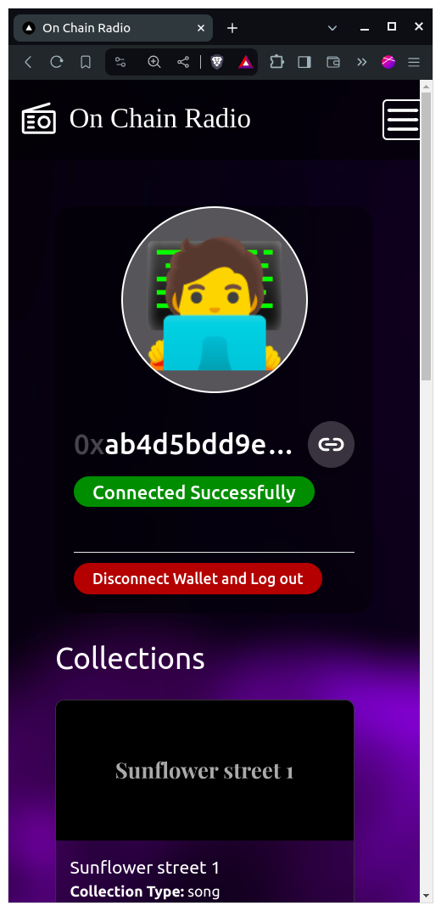
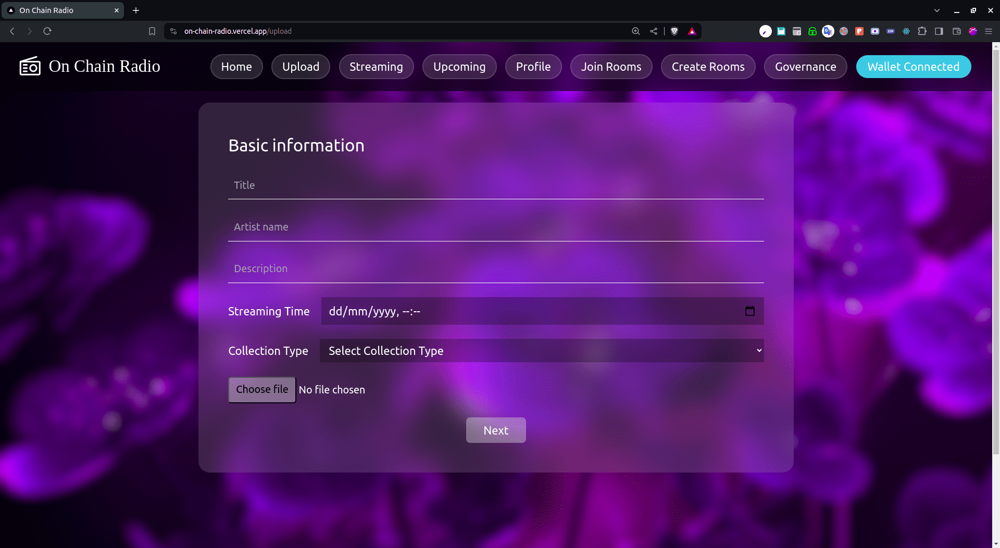
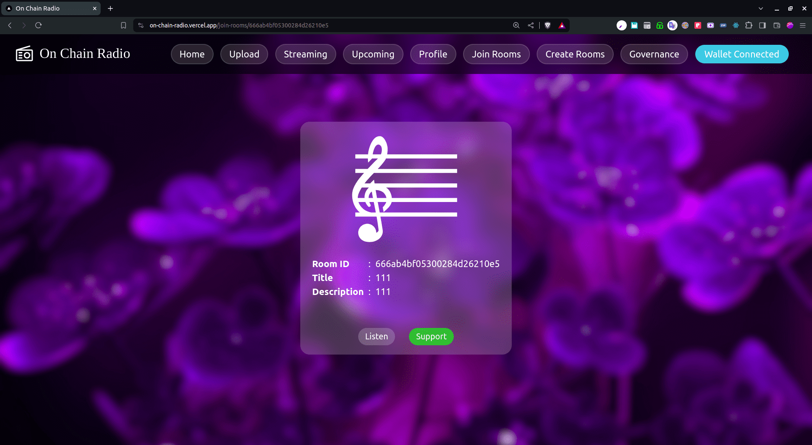

# On Chain Radio
| | |
|-|-|
||  |

# Tech-stack Used

### Primary

1. `Yarn` : Package manager.
1. `TypeScript` : Programming language.
1. `Next.JS (v14.0.2)` : Full-stack web development framework.
1. `aptos` : Interacting with blockchain.
1. `socket.io-client` : For connecting to streaming server.
1. `tailwindcss` : CSS framework.
1. `mongoose` : MongoDB ORM.

### Secondary

1. `jsonwebtoken` : Issuing and verification of JSON-web-tokens.
1. `react-lottie` : React animations.
1. `react-icons` : Standard consistent react icons.
1. `react-h5-audio-player` : Playing audio data.
1. `tweetnacl` : Cryptographic signature verification.
1. `uuid` : generating universally unique Identifer.
1. `crypto` : Cryptography related utility functions.
1. `@react-pdf/renderer` : To display pdf in browser.

# To test the application

1. Requirements `Node.JS >= 18`
2. After downloading the repository, run `yarn install`
3. to run the application in development, run `yarn dev` and go to `http://localhost:3000`.
4. Having the aptos wallet chrome extension is necessary to perform some actions like creating audio, creating rooms for live streaming.
5. The application consists of pages to view streamed (`/`), streaming (`/streaming`) and upcoming audio (`/upcoming`).

# Features Implemented

1. Dynamic PDF Generation of Copy right document.
1. Live Audio streaming by creating and joing room.
1. Petra wallet based JWT Authentication.
1. User profile page displaying the user transaction history.

# User stories

1. Uploading Audio to Blackchain (Ipfs, Database)

# Links

1. **Deployment link** : 
    1. **Frontend (Main)**: [https://on-chain-radio.vercel.app/](https://on-chain-radio.vercel.app/)
    1. **Socket.io Streaming server** : [https://streaming-server-waterbottle.koyeb.app/](https://streaming-server-waterbottle.koyeb.app/)
1. **Github Repo** : 
    1. **Frontend** : [https://github.com/Mallikarjun362/on-chain-radio](https://github.com/Mallikarjun362/on-chain-radio)
    1. **Socket.io Streaing server** : [https://github.com/Mallikarjun362/socket-io-streaming-server](https://github.com/Mallikarjun362/socket-io-streaming-server) 

# Demo
### Profile page
| | |
|-|-|
|||

### Audio upload page

### Listeners page

